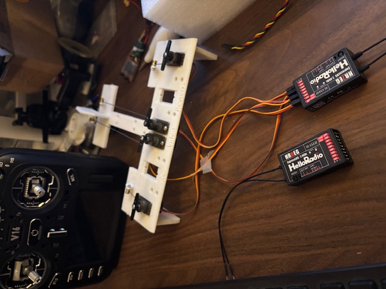
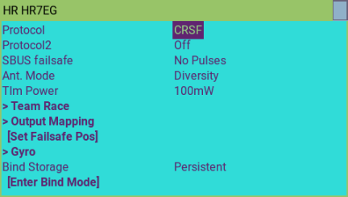
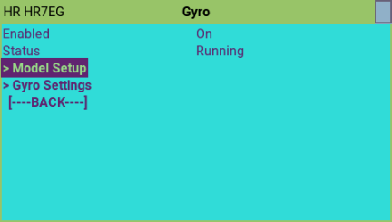
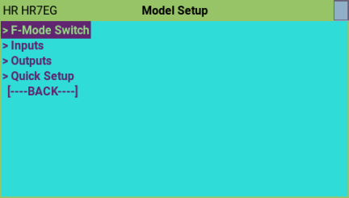
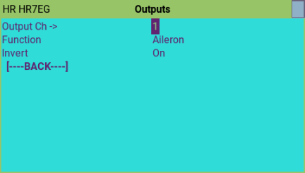
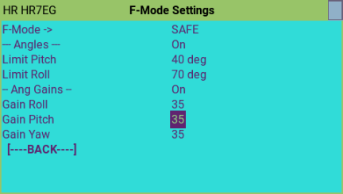
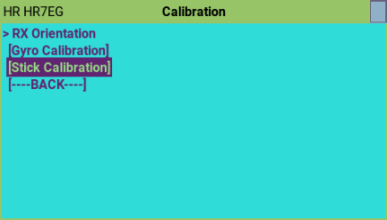
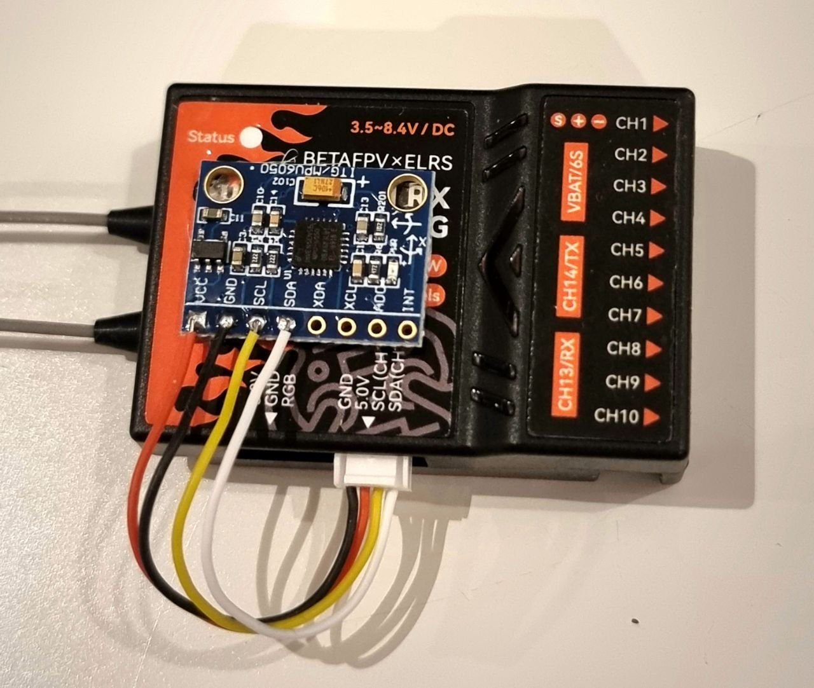

## HISTORY

This code is an adaptation of the original gyro code created by Alex Wigen [Original Code](https://github.com/awigen/ExpressLRS/tree/add-rx-gyro-support).
A lot of code has been changed from the original to make it easier to setup..  

I got some of the new RX with Gyro from Hello Radio Sky to play (Thanks Ken!). The idea is to have code that works out-of-the box for this receivers.

This code is the Official ELRS v4.0 + Gyro.

## Video

Created a video showing the configuration [VIDEO] (https://www.youtube.com/watch?v=Wk4s1B-1F_4)

## Gyro Support for HelloRadio HR7EG/HR8EG

This branch adds support for the internal gyro on HelloRadio Gyro Receivers.

## DISCLAIMER !!!!!

This is an experimental branch not ready for prime time. **Experiment at your own risk**.

## Feature list (Todo)
- [x] Quick Model Setup
  - [x] 1-Click setup of all the setting for the Gyro to work
  - [x] Wing-Type: Normal, 2-Ail, Delta
  - [x] Tail-Type: Normal, VTail, Taileron, Rudder-only

- [x] Model Setup
  - [x] Mode Switch Flight-mode Assigments
  - [x] LUA Input channel assignments
  - [x] LUA Output channel assignments

- [x] Gyro Settings
  - [x] Fight Mode parametes configurable per flight mode.
    - [x] Level Trim
    - [x] Gains for Roll,Pitch,Yaw
    - [x] SAFE Max angle Limits

  - [x] Stick Calibration
    - [x] Simplified Gyro servo output Limits (center sticks, move sticks)
    - [x] Scale corrections according to channel limits, and gains

  - [x] Gyro Calibration
  - [x] Simplyfied Gyro RX Orientation (Set model level, then vertical)  
    - [x] ONLY HORIZONTAL CURRENTLY, but any rotation

  - [x] LUA PID adjustment settings (Advanced)

- [x] Multiple Flight Modes
  - [x] Gyro mode: Rate
  - [x] Gyro mode: Safe, Max Angle Envelope
  - [x] Gyro mode: Level
  - [x] Gyro mode: Launch (Level + pitch up)
  - [x] Gyro mode: Hover

## Setup

**IMPORTANT: Use the ELRS.lua from this branch, since the gyro use multiple nested level of menus** it will show in the screen as (r17-gyro). Additionally, when you navigate to a sub-menu, the title will show in the middle. 

The gyro settings are available through the
[ExpressLRS Lua script](https://www.expresslrs.org/quick-start/transmitters/lua-howto/).

### Finding the settings menus

1. First launch the ExpressLRS Lua script.
1. Go to "Other Devices".
1. Select your receiver.
1. If your receiver is correctly flashed you will see gyro menu items. 
1. If you are using the elrs.lua from this branch, you will see the sub-menu title when navigating into another sub-menu.

### Gyro Menu

By default, the Gyro will be OFF. This RX will work normally without Gyro functionality.
The faster way to get things up and running is to:

1. Quick-Setup:  Go to Model-Setup -> Quick Setup to define your plane.
1. Turn the Gyro ON in the main gyro page.
1. Go to Gyro-Setting: Perform Gyro Calibration, Perform RX orientation

### Model Setup

### Quick Setup

In here, you can setup your RX/Gyro really quickly.   Select your wing-type and tail-type, then execute.   This will setup complely the model part of the gyro. It will do:

1. Configure All options of the gyro.
1. Configure Inputs and Outputs for the specified plane.
1. Configure flight-mode switch on Ch9 to have a 3-pos switch:  Off, Rate, Level
1. Configure Master gain on Ch10.
1. The only thing missing will be to turn the Gyro ON and do calibration.

### Model Setup: Gyro Inputs

In the "Gyro Inputs" menu you can setup mappings between input channels to gyro
functions.

The gyro input functions are:

* Roll input
* Pitch input
* Yaw input
* Mode - Selection of stabilization mode
* Gain - Adjustable Master Gyro Gain 0% - 100%

###  Model Setup: Gyro Outputs

In the "Gyro Outputs" menu you can setup mappings between gyro functions and PWM
output channels. To view the settings for each channel, edit-change the top Output channel, and the other fields will refresh acordingly. 

The gyro output functions are:

* Aileron output
* Elevator output
* Rudder output
* Elevon output  (Elevator + Aileron Mix: Left and Right)
* V-Tail output  (Elevator + Rudder Mix: Left and Right)

For each channel you can setup gyro output inversion. A typical setup is having
two aileron servos where one of the output channels needs to be reversed.

For Elevon/Vtail,  first make the Elevator to work on the right direction, then use the Left/Right option to invert the secondary function (Ail or Rud).

 

###  Model Setup: Gyro Modes

A input channel configured for "Mode" in the "Gyro Inputs" menu can be used to
select the active stabilization mode.

#### Rate Mode

This is the most basic gyro mode. Changes to the angular velocity in any
direction will result in a correction.

#### Heading Hold / Heading Lock Mode

Not yet implemented.

#### SAFE Mode (Max Angle Envelope protection)

In this mode the gyro will work to limit pitch and roll angles within the configured limits.

Once you reach the Max angle, the gyro will not allow to go any further.. you need to move the stick to center and oposite direction to go back to normal.

#### Level Mode   (Angle Demand)

In this mode the gyro will work to keep the pitch and roll angles at zero when
channel inputs are zero.

If the roll stick command is 50%, the gyro will attempt to keep the roll angle at 50% of the max roll angle.

#### Hover Mode

NOT TESTED
In this mode the gyro will add corrections to elevator and rudder channels in
order to keep aircraft pointing directly upwards.

### Gyro Settings

####  Flight Mode Settings
Here you can change settings for each specific flight mode.  If the option is ON, it will override the defaults for ALL the settings.

On the top, select the flight mode you want to edit.

 

#### Calibration

1. Gyro Calibration: Set the RX flat, this is for the Gyro to learn the axis of gravity for the RX (Z-Axis).
1. RX orientation.. You will set the plane level (learn level trim), and the set the plane with the nose up to learn the orientaion.
1. Stick Calibration is to learn the center and max travel of Ail, Ele and Rud.  

## Hello Radio Sky Hardware

## DIY Hardware

The test hardware currently used is a BetaFPV SuperP receiver with an external GY-521 MPU-6050 I2C module.

